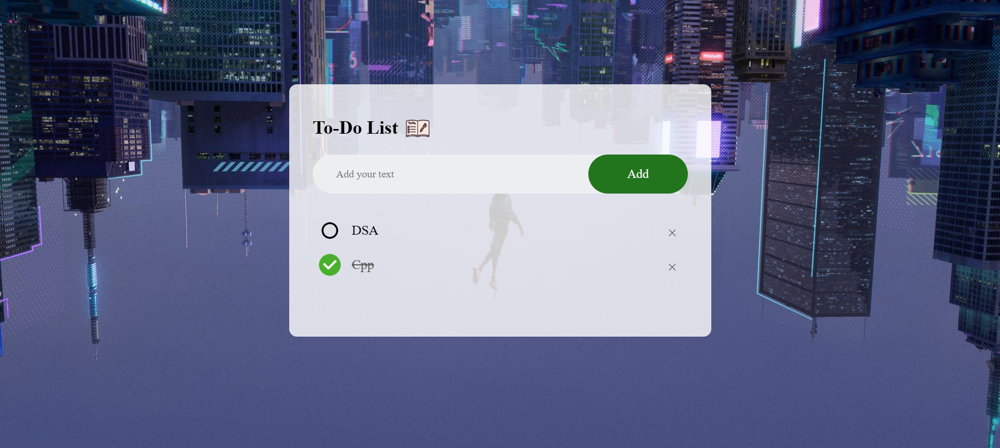

# To-Do List Application 📝

A simple and responsive To-Do List web application to help you manage your daily tasks efficiently. This project is built using **HTML**, **CSS**, and **JavaScript**.

## Features 🌟
- Add tasks to your to-do list.
- Mark tasks as completed.
- Remove tasks from the list.
- Save tasks in the browser's local storage to maintain data across sessions.
- Light and dark theme toggle for better user experience.

## Demo 🚀
Check out the live demo: https://arjun-holland.github.io/To-Do-List/

## Screenshots 📸

### Prerequisites
- A modern web browser (e.g., Chrome, Firefox, Edge, Safari).

## Linkdin
https://www.linkedin.com/in/veesam-mallikarjuna-29a995289/

## Leetcode
https://leetcode.com/u/mallikarjuna1432/

